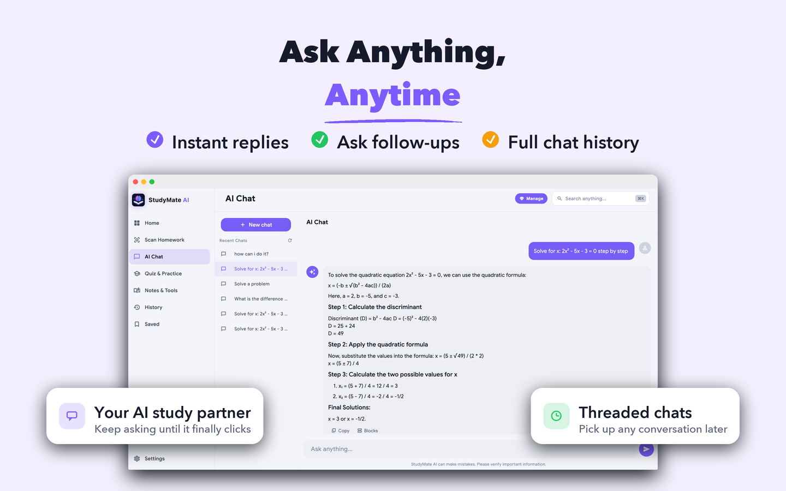
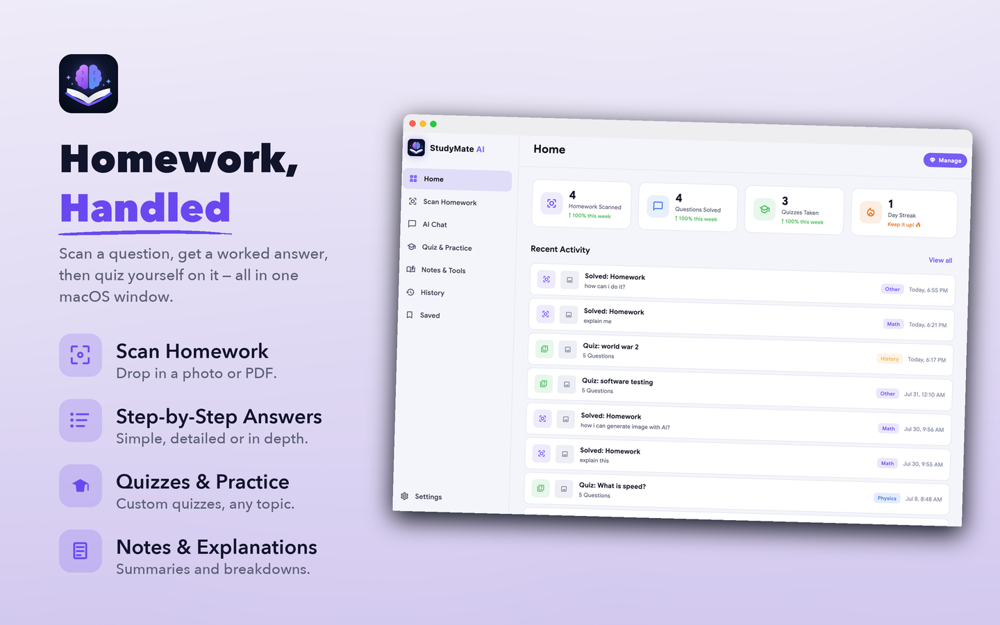
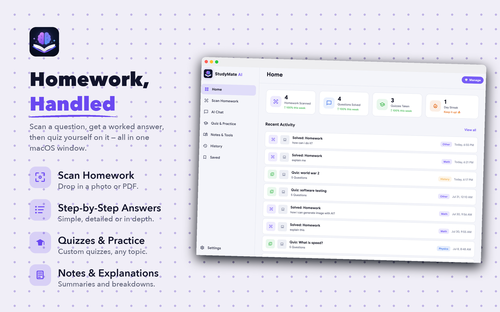
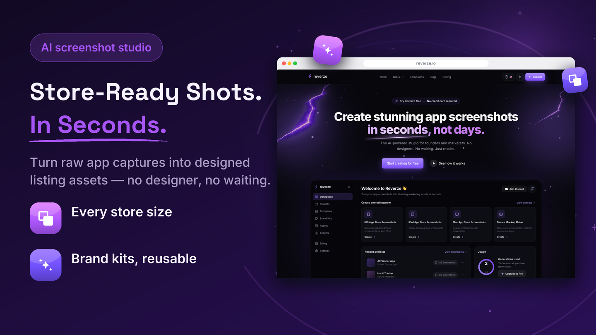
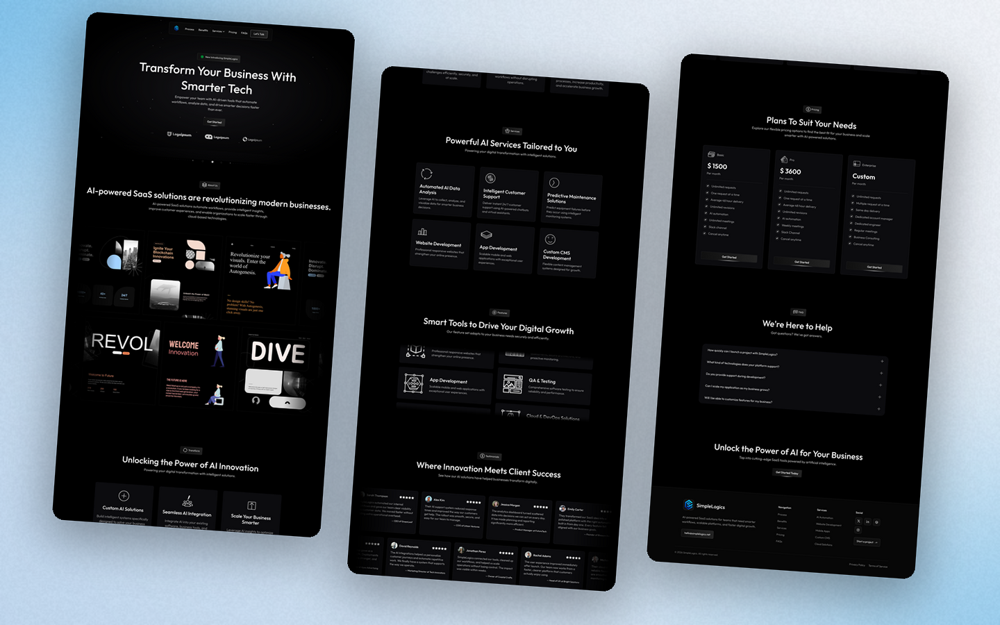
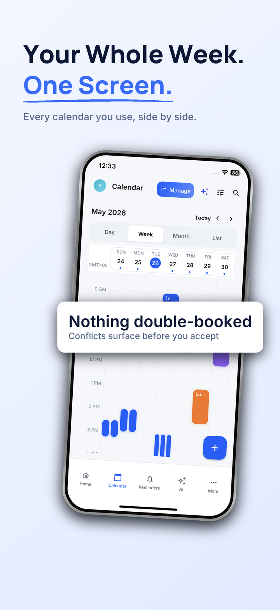
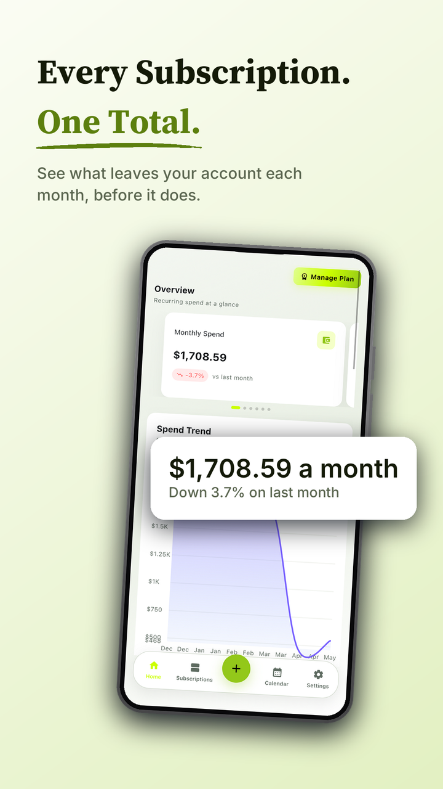
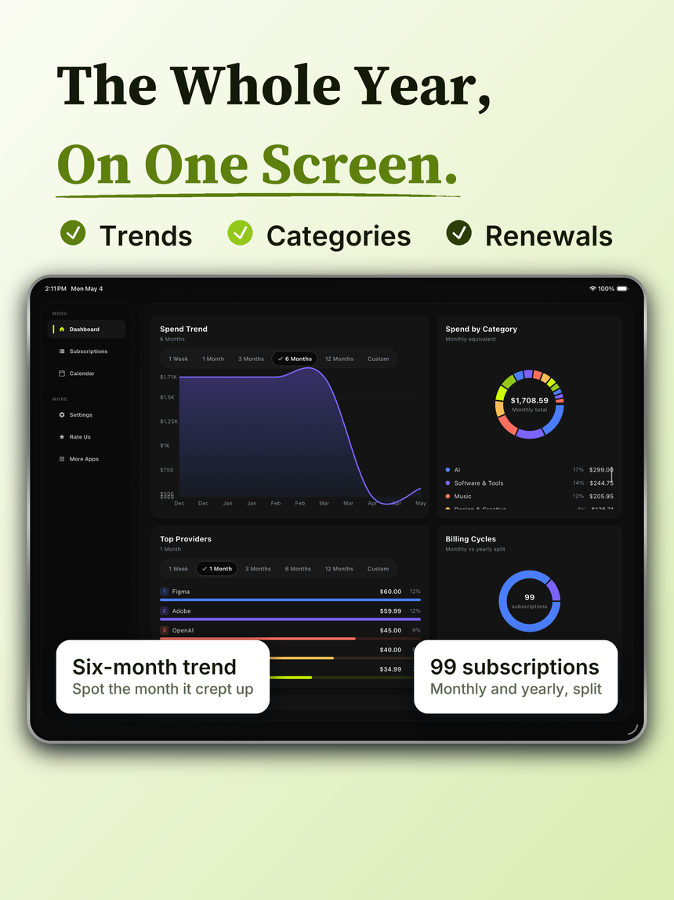
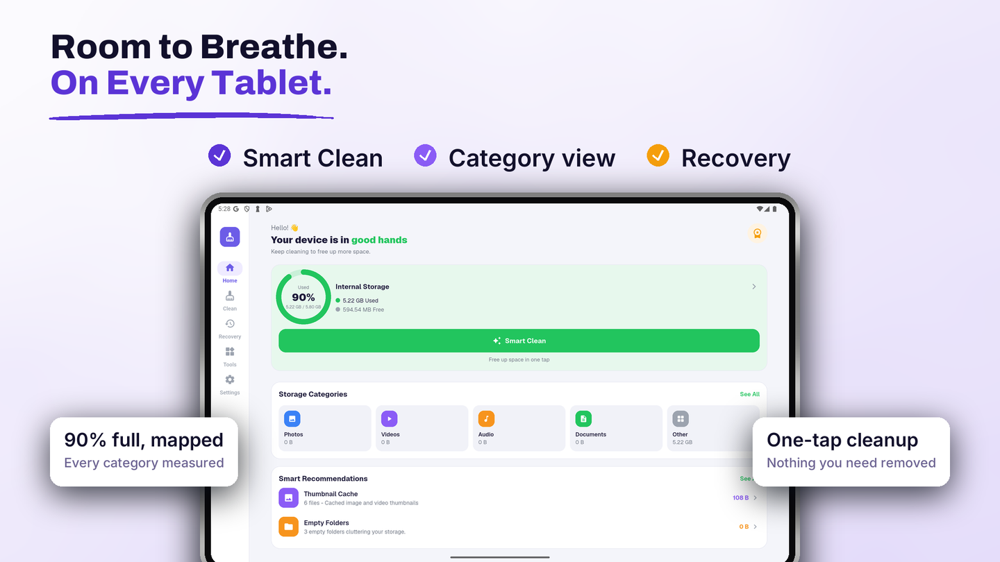
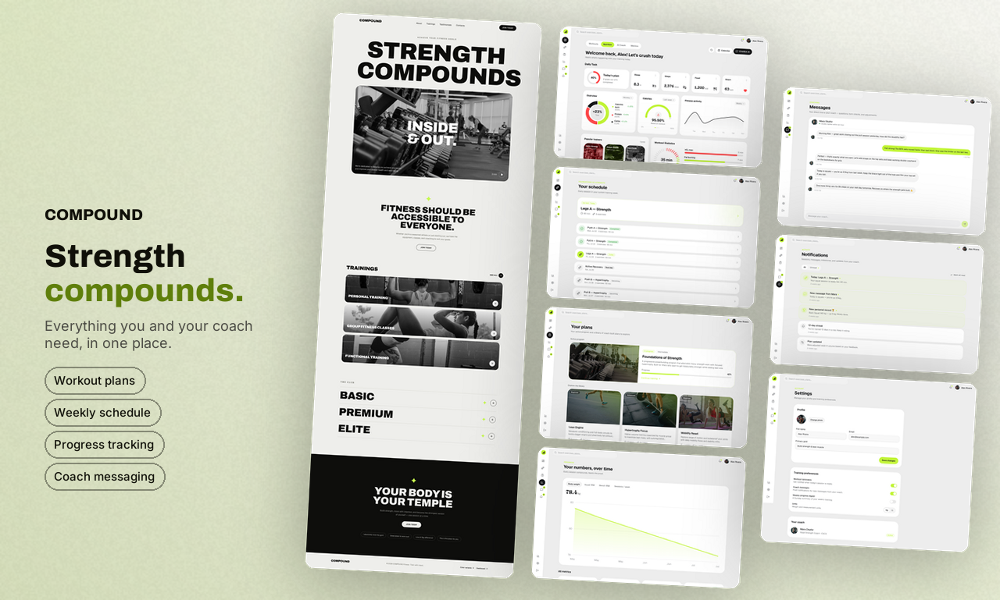

# store-screenshots

An [Agent Skill](https://docs.claude.com/en/docs/agents-and-tools/agent-skills/overview)
that turns raw app captures into a designed App Store / Google Play screenshot
set — or a framed, branded screenshot of a website — without ever letting an
image generator touch your app's UI.



*Built by this skill from a raw macOS capture. The app window is the real
screenshot, composited pixel-for-pixel. Everything else — background, type,
check row, callout cards, the window chrome — is drawn locally with Pillow.*

---

## The problem this solves

Store screenshots are the highest-leverage conversion surface an app has. Most
installs are decided in the listing, from the first two tiles, at thumbnail
size, before anyone reads the description. And they are usually made one of two
bad ways:

**1. Asking an image model to "design store screenshots from this screenshot."**
Image models *regenerate* a reference; they cannot composite exact pixels. The
output is reliably broken in the same ways every time:

- invented empty gaps in the interface
- a tablet layout appearing inside a phone frame
- the status bar missing
- horizontally stretched UI and squashed letterforms
- restyled labels and altered row spacing

No prompt wording fixes this. It is what the model *is*. And every one of those
failures is a rejection risk — Apple rejects screenshots that misrepresent the
app.

**2. Hand-building each tile in Figma.** Correct, but slow, and it drifts: six
tiles stop looking like one set, and the sizes for six device slots have to be
maintained by hand.

**What this skill does instead:** it composites locally. Your capture is pasted
at its **true aspect ratio**, derived from the source image and never assumed,
so UI physically cannot stretch. The background, typography, callout cards,
device bodies and props are all *drawn* — so type is never distorted, and the
background can be generated once at full strip width and sliced per tile, which
is what makes six tiles read as one designed set instead of six posters.

It also handles the parts that are judgement, not rendering: researching the
category's reference listings first, writing benefit-led copy instead of
copying UI labels, choosing a typeface that fits what the app *is*, and
verifying against a pre-delivery checklist.

### And it has no house style

The compositor ships **no default look**. Palette, background, layout, typeface
and props all come from config, derived from the app's own brand and category.

Same app, same captures, two art directions — this is a config change, not a
different tool:

| `"background": "mesh"` | `"background": "dots"` |
|---|---|
|  |  |

And two different products, run through the same compositor on the same day —
one loud and violet in a browser frame, one a whole page sliced and angled on a
pale backdrop. Palette extracted from each site's own logo, typeface chosen
from what each product *is*:





If two different apps come out of this skill looking like siblings, it was used
wrong.

### Every slot, from the same config

One tool covers phone, tablet, desktop and web — and a set built for one store
keeps its palette and type scale on the next:

| iPhone 6.9″ · 1320 × 2868 | Android phone · 1080 × 1920 |
|---|---|
|  |  |
| `hero-center`, `"device_style": "phone"` | `hero-center`, `"device_style": "android"` |

| iPad 13″ · 2064 × 2752 | Android tablet · 1920 × 1080 |
|---|---|
|  |  |
| `showcase`, `"device_style": "tablet"` | `showcase`, `"device_style": "tablet"` |

The Android phone tiles and the iPad tile are the **same product** — same lime
accent, same serif display face, same type scale, three slots apart. That is the
checklist item *"one palette and one type scale across every tile and every
platform"*, and it is the reason a set built for one store does not have to be
redesigned for the next.

---

## Install

The skill is a folder. Drop it where your agent looks for skills.

**Claude Code — personal (all projects):**

```bash
git clone https://github.com/<you>/store-screenshots.git ~/.claude/skills/store-screenshots
```

**Claude Code — one project only:**

```bash
git clone https://github.com/<you>/store-screenshots.git .claude/skills/store-screenshots
```

**Claude.ai / Claude Desktop:** zip the folder and upload it under
Settings → Capabilities → Skills.

```bash
zip -r store-screenshots.zip store-screenshots -x '*/.git/*' '*/assets/fonts/*'
```

Either way the layout must stay:

```
store-screenshots/
├── SKILL.md              ← the agent reads this first
├── references/           ← loaded on demand, not up front
└── scripts/              ← run, not read into context
```

### Dependencies

```bash
pip install -r requirements.txt
```

Python 3.9+, plus `pillow` and `numpy`. Nothing else — no headless browser, no
design tool, no image API.

**Fonts.** Google families are downloaded on first use from the `google/fonts`
repo into `assets/fonts/` and cached (git-ignored). That needs network access
on the first run only.

> **macOS is the tested platform.** The offline fallback faces in
> `scripts/fonts.py` are macOS system fonts (`/System/Library/Fonts/`). On
> Linux or Windows the Google fetch path works, but if it fails there is no
> local fallback and you get a `FileNotFoundError`. Point `LOCAL` in
> `scripts/fonts.py` at your own system faces if you need offline use there.

---

## Use it

### The normal way: just ask

Once installed, the skill triggers on its own. Say what you want in plain
language:

> "Make Play Store screenshots for this app — captures are in `./captures`."
>
> "Redesign our App Store listing tiles, we got rejected under 2.3."
>
> "I need a 1200×630 OG card for the landing page."
>
> "Resize this iPhone set for the 6.5″ slot."

The agent then works the pipeline in `SKILL.md` rather than jumping straight to
rendering:

1. **Understand the product** — reads the codebase and the marketing site, and
   builds a feature inventory of *what each feature does for the user*. That
   column becomes the copy. It never writes copy from screenshot contents alone.
2. **Research reference listings** — opens the top listings in your actual
   category on your actual storefront, and reports the conventions back to you
   before designing anything.
3. **Propose an art direction, and ask** — accent extracted from your icon,
   background style, composition archetype, props on or off. One round of
   questions, because these are cheap to answer and expensive to redo.
4. **Write the copy** — 2–3 word headlines, one accent word, benefits not UI
   labels.
5. **Build** with `scripts/build_tiles.py`.
6. **Verify** against `references/checklist.md` — exact pixel size, no alpha
   channel, UI matches the capture, legible at thumbnail width.

Expect it to ask you things in step 3 and to show you the copy table before it
renders. That is the skill working, not the skill stalling.

### Driving the scripts directly

You do not need the agent to use the compositor.

**Ask which typeface fits — before writing any config:**

```bash
python3 scripts/build_tiles.py --suggest-fonts "storage cleaner for mac"
```

```
  "font_display": "archivo", "font_text": "inter"
    Utility needs headlines that punch at thumbnail size and body copy that
    disappears. Archivo goes properly heavy; Inter stays out of the way.
```

**Pull the accent out of the app icon, instead of inventing one:**

```bash
python3 scripts/build_tiles.py --palette-from assets/icon.png
```

**Render a set:**

```bash
python3 scripts/build_tiles.py --platform macos \
    --config examples/macos-tiles.json \
    --shots ./captures --out ./designed
```

The configs that produced these are all here:

| Config | Platform | Output |
|---|---|---|
| `examples/macos-tiles.json` | `macos` | a complete five-tile macOS set |
| `examples/ios-tiles.json` | `ios` | tiles 09, 10 |
| `examples/android-phone-tiles.json` | `android-phone` | tiles 11, 12 |
| `examples/ipad-tiles.json` | `ipad` | tile 13 |
| `examples/android-tablet-tiles.json` | `android-tablet` | tile 14 |
| `examples/web-hero-reverze.json` | `web-hero` | tile 06 |

Copy one and change the values. The 6.5″ iPhone slot needs no new config —
point `--platform ios-65` at the same file and it renders natively at
1242 × 2688.

**Every platform is one flag:**

```bash
python3 scripts/build_tiles.py --platform android-phone  --config t.json --shots ./caps --out ./out
python3 scripts/build_tiles.py --platform ios            --config t.json --shots ./caps --out ./out
python3 scripts/build_tiles.py --platform ios-65         --config t.json --shots ./caps --out ./out
python3 scripts/build_tiles.py --platform web-og         --config t.json --shots ./caps --out ./out
```

| `--platform` | Output | Slot |
|---|---|---|
| `android-phone` | 1080 × 1920 | Play phone, 2–8 images |
| `android-tablet` | 1920 × 1080 | Play 7″/10″ tablet |
| `ios` | 1320 × 2868 | iPhone 6.9″ — **required**; Apple scales it down to every smaller iPhone |
| `ios-65` | 1242 × 2688 | iPhone 6.5″ — optional, and a *different aspect ratio*, so render it natively, never resize |
| `ipad` | 2064 × 2752 | iPad 13″ |
| `macos` | 2880 × 1800 | Mac App Store, 16:10 |
| `web-hero` | 2560 × 1440 | landing hero, README header, docs banner |
| `web-og` | 1200 × 630 | Open Graph / Twitter / LinkedIn preview |
| `web-square` | 1080 × 1080 | Instagram, carousel, changelog post |
| `web-tall` | 1440 × 2160 | whole-page capture |

Full requirements, counts and formats: [`references/platform-specs.md`](references/platform-specs.md).

---

## Config

One JSON file: a `theme` (applies to the whole set) and a list of `tiles`.

```json
{
  "theme": {
    "bg": "#FBFAFE", "bg2": "#E4DCFA", "background": "mesh",
    "accent": "#5B34D6", "accent2": "#8B5CF6",
    "ink": "#12102B", "sub": "#5C5878", "card": "#FFFFFF",
    "font_display": "archivo", "font_text": "inter",
    "props": "3d", "icon_style": "3d",
    "halo": 0, "swirl_alpha": 0, "device_shadow": 38
  },
  "tiles": [
    {
      "slug": "storage-overview",
      "layout": "hero-mac",
      "shot": "home.png",
      "pill": "Storage, mapped",
      "head": [["All Your Storage.", false], ["At a Glance.", true]],
      "sub": "See exactly what is filling your disk, measured by category.",
      "features": [
        {"title": "Every category, measured", "colour": "#16A34A", "icon": "gauge"},
        {"title": "Smart recommendations",    "colour": "#6D4AEC", "icon": "sparkle"}
      ],
      "props": [{"x": 0.525, "y": 0.16, "glyph": "folder", "colour": "#6D4AEC", "r": -8, "s": 0.05}]
    }
  ]
}
```

`head` is a list of `[text, is_accent]` pairs — one entry per line, `true` on
the line that takes the accent colour.

### Layouts

| `"layout"` | Shape | Best for |
|---|---|---|
| `hero-center` *(default)* | headline top, device below, callout cards over its edges | single-purpose apps with one strong screen |
| `feature-left` | icon + headline + vertical feature list left, device right | feature-rich apps that must prove breadth |
| `showcase` | headline + benefit check-row on top, wide window below, corner cards | desktop apps and dashboards |
| `hero-mac` | text column left, machine/browser window right | macOS tiles and landscape website tiles |
| `object-hero` | 3D icon or props floating, minimal UI | opener tile only |
| `stacked-devices` | two or three devices overlapping at depth | flows worth showing as a sequence |

`showcase` — check row on top, corner callout cards over the window:


### Device frames

`"device_style"` picks the body drawn around the capture. Each one is drawn as a
real object, not an outline — a flat rounded rectangle reads as a wireframe and
cheapens the whole set.

| Value | Body | Use for |
|---|---|---|
| `phone` *(default on phone slots)* | iPhone: titanium rail with specular bands, four side buttons, iPhone corner radius | iOS phone tiles |
| `android` | Anodised matte rail, tighter corner radius, power + volume on the right only | Play Store phone tiles |
| `tablet` | Uniform thin rail, small radius fraction, no side buttons | iPad and Android tablet tiles |
| `macbook` *(default for `hero-mac`)* | Laptop body with a base | macOS tiles |
| `window` | App window with a title bar | macOS, when the laptop body is too much |
| `browser` *(default on `web-*` slots)* | Traffic lights and a URL pill — pass `"url"` | website tiles |

Where the capture already contains device chrome (Dynamic Island, status bar),
let it come through from the capture rather than drawing over it.

> **An iOS capture inside an Android body is a lie a reviewer can see.** The
> Android examples here were built from iPhone captures to demonstrate the frame,
> with `"shot_crop": [0, 0.052, 1, 1]` trimming the Dynamic Island off the top —
> which is the only reason they hold up. For a real Play listing, capture on
> Android. A visible iOS status bar inside a Pixel body is the first thing a
> reviewer notices.

### Useful keys

**Theme:** `background` (`gradient` · `mesh` · `dots` · `contour` · `solid`),
`accent`/`accent2`/`accent3`, `ink`, `sub`, `card`, `font_display`,
`font_text`, `props` and `icon_style` (`none` · `flat` · `3d`), plus the
shadow/glow dials — `halo`, `hero_glow`, `hero_shadow`, `ground`,
`swirl_alpha`, `prop_shadow`, `prop_glow`, `device_shadow`.

**Tile:** `slug`, `layout`, `shot`, `shot_crop` `[l,t,r,b]` as fractions,
`head`, `sub`, `pill`, `features`, `checks`, `card`/`left_card`/`right_card`,
`cta`, `badge`, `props`, `app_icon`, `device_w`, `device_h`, `device_style`,
`url`, `rotate`, `underline`, `side`, `seed`, and `yaw`/`pitch`/`depth`/`focal`
for a 3D hero object.

Not every key applies to every layout — `checks` and `left_card`/`right_card`
are `showcase`, `features` is `feature-left` and `hero-mac`, `card` + `side` is
`hero-center`. A key the layout does not read is ignored silently, so if
something you set does not appear, check the layout first.

> **Dial the shadows back on light backgrounds.** Every value that looks right
> on a dark background turns to grey haze on a light one. Roughly a third, and
> set `halo` and `swirl_alpha` to `0` — they band and smudge. The table is in
> [`references/art-direction.md`](references/art-direction.md).

---

## Websites

A website screenshot is the same compositor with a browser window instead of a
phone — traffic lights and a URL pill, `"device_style": "browser"` (the default
for `web-*` presets). Pass the real address as `"url"`; a placeholder URL on a
public tile is a credibility leak.

Capture at DPR 2 or better, or page text turns to mush at tile scale:

```bash
chrome --headless --force-device-scale-factor=2 --window-size=1440,4200 \
    --screenshot=page.png --virtual-time-budget=9000 https://example.com
```

`examples/web-hero-reverze.json` is the config behind the 2560 × 1440 hero
above, built from a `--force-device-scale-factor=2` capture of the live site.
An OG card is the same shape at `--platform web-og`: one headline of four words
or fewer, and either a cropped section of the page or no capture at all — a
whole page at 1200 × 630 is illegible.

For a **whole page** — where a browser frame just makes an unreadable ribbon —
`scripts/page_mockup.py` trims the trailing blank rows, slices the page into
columns, rounds and shadows them, and floats them on a gradient. Arbitrary
output size, so it also covers off-spec asks like a 1280 × 769 README image:

```bash
python3 scripts/page_mockup.py --shot page.png --out docs/site.png \
    --size 1440x900 --bg "#F7FAFF,#C3DCF5" --glow "#0697E6" --cols 3 \
    --gap 42 --stagger 24 --angle 145 --shadow 95 --margin 26 --tilt -4
```

That is the command behind the simplelogics.net image above: 16,400 px of
capture sliced into three columns. The page reads as a shape and a rhythm —
you can see it is a long marketing site with a hero, a services grid and a
pricing table, which is all a hero image needs to say. Dark page on a light
backdrop, because a dark page on a dark backdrop disappears.

**Angle it.** `--tilt -4` rotates the whole set — sheets and their shadows
together, as one object — and it is the difference between a mockup and an
export. Three to five degrees in-plane. Never perspective skew, which makes UI
unreadable (pitfall #5). The fit is solved *before* rotating, so the columns
shrink to stay inside the tile instead of having their corners clipped.

Or `--board` to put the landing page beside the signed-in app screens, with a
copy panel:




```bash
python3 scripts/page_mockup.py --board "page.png|dash.png,plans.png|inbox.png" \
    --out docs/board.png --size 1280x769 --bg "#FDFDF6,#CBD9A2" --glow "#AFDC3C" \
    --tilt -3 --text-col 0.30 --title "Brand" --headline "Two words|accented." \
    --sub "One supporting line." --pills "Progress tracking,7 app screens"
```

`--text-col` and `--bleed` belong to `--board` and error out on `--shot` rather
than silently doing nothing. `--tilt` and `--shadow` work on both. Two things
separate a board that looks designed from one that looks exported: never leave
it dead straight (`--tilt -3`, three to five degrees in-plane, never
perspective), and keep the shadows off the backdrop
(`--shadow 80` is plenty on light; heavier muddies the gradient).

Signed-in routes need a session. Launch a real browser you sign into yourself —
Playwright's `launch_persistent_context` with `channel="chrome"`,
`headless=False` — and let the profile directory persist. **The agent must
never type your password**, and lifting a session cookie out of another browser
is handling a live credential.

---

## What's in the box

| File | What it is |
|---|---|
| `SKILL.md` | The workflow the agent follows. Start here if you're reading the skill itself. |
| `references/art-direction.md` | Archetypes, palettes, backgrounds, typeface pairings, the light-background shadow table |
| `references/platform-specs.md` | Exact sizes, counts and formats per store, and how to capture sources |
| `references/research.md` | How to research competitor listings, and why category conventions don't transfer between stores |
| `references/pitfalls.md` | 16 failures this skill exists to prevent, each one from a real project |
| `references/checklist.md` | Pre-delivery verification — technical, UI fidelity, copy, design, honesty |
| `scripts/build_tiles.py` | The compositor |
| `scripts/page_mockup.py` | Whole-page website mockups (sliced columns on a backdrop) |
| `scripts/fonts.py` | Typeface registry + the category-aware `--suggest-fonts` advisor |
| `examples/` | Real output from this skill, and the config that produced it |

---

## Rules worth knowing before you start

These are load-bearing. They come out of rework, not taste.

- **Never let an image generator draw app UI.** Background art with no UI and no
  text is fine. Anything else gets composited.
- **Never apply 3D perspective skew to a device.** Flat in-plane rotation of
  3–5°, or upright. Perspective makes the UI unreadable and looks broken.
- **Never stretch type** to fit a width, and never fake weight by outlining.
- **Copy sells the benefit, never app data.** A badge lifted off a screenshot
  (`100% @ 8 pts`) means nothing to someone who has never used the app.
- **Save RGB with no alpha channel.** An alpha channel is an App Store rejection
  cause.
- **6.9″ and 6.5″ iPhone sets have different aspect ratios.** Render both
  natively; never resize one into the other.
- **Report product bugs you find while capturing.** If a tablet capture is
  letterboxed with black bars, the app has no tablet layout. Crop it for the
  tile *and* say so — reviewers and users see what the tile hides.

The long version, with symptoms and causes, is in
[`references/pitfalls.md`](references/pitfalls.md).

---

## Contributing

Issues and PRs welcome. Two things to keep in mind:

- **New style keys must be additive** — an absent key means byte-identical
  previous output.
- **Anything learned the hard way belongs in `references/pitfalls.md`**, with
  the symptom, the cause and the fix. That file is the reason the skill works.

## Licence

MIT — see [LICENSE](LICENSE). Fonts are downloaded at runtime and stay under
their own licences (OFL 1.1); none are bundled here.
